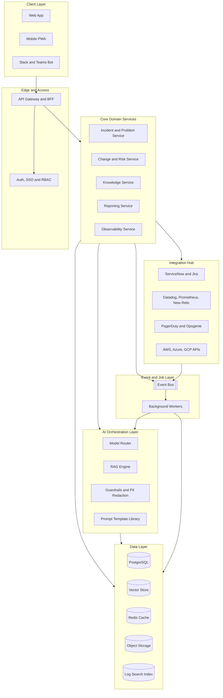
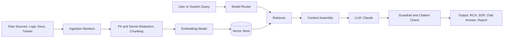
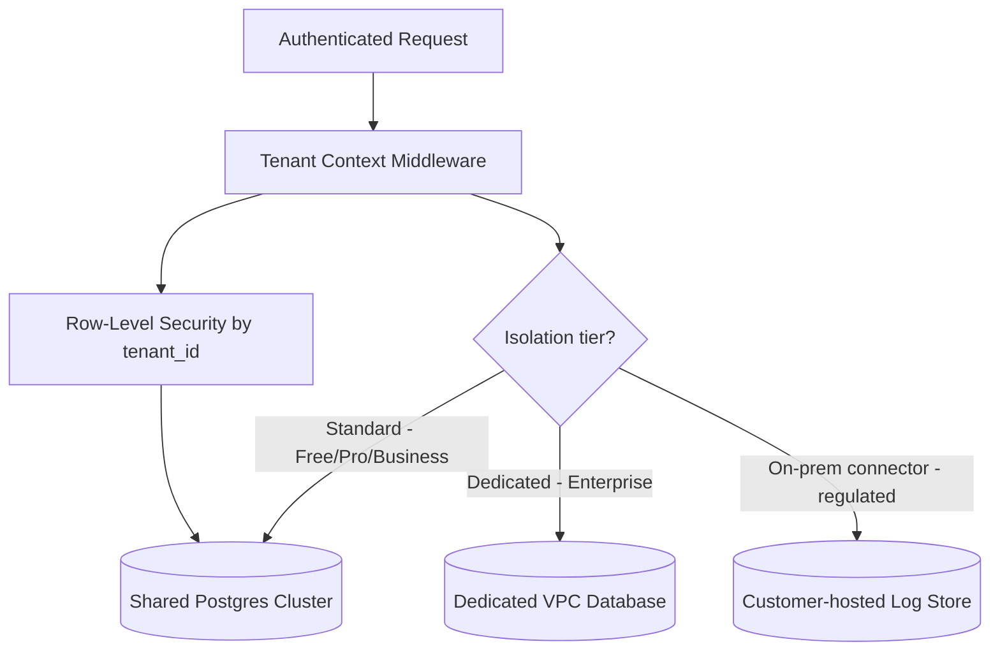
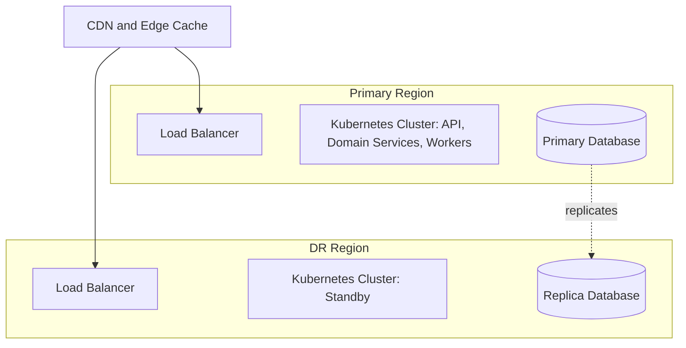

# OpsPilot AI — End-to-End Architecture

Architecture Blueprint · v0.1 · 31 Jul 2026 · draft for internal planning, not a committed spec.

An AI-native IT operations platform that unifies incident response, change and risk, knowledge, reporting, and observability into one system — built around a shared AI orchestration layer instead of sixteen separate features.

**Scope:** 16 product modules · 5 domain services · 4 pricing tiers
**Targets:** SaaS · MSP · Banking · Telecom · OTT · Cloud Ops / DevOps / NOC / SOC

## Contents

- [Overview](#overview)
- [Product & Customer Context](#product--customer-context)
- [Architecture at a Glance](#architecture-at-a-glance)
- [Module → Domain Service Map](#module--domain-service-map)
- [AI & RAG Pipeline](#ai--rag-pipeline)
- [Data Architecture & Multi-Tenancy](#data-architecture--multi-tenancy)
- [Integration Hub](#integration-hub)
- [Security, Compliance & Data Governance](#security-compliance--data-governance)
- [Deployment & Infrastructure](#deployment--infrastructure)
- [Technology Stack](#technology-stack)
- [Pricing Tiers → Architecture Mapping](#pricing-tiers--architecture-mapping)
- [Build Roadmap](#build-roadmap)

---

## Overview

Today, a NOC or SOC team runs its operational lifecycle across five or six disconnected tools: a ticketing system for incidents, a wiki for runbooks, a monitoring stack for signals, a spreadsheet for risk, and Slack threads for shift handover — with a human manually stitching the narrative between them for every RCA, customer update, and exec report. OpsPilot AI's architecture is built around collapsing that stitching work into a single AI layer that sits across the whole lifecycle: **detect → understand → act → communicate → improve**.

Rather than building sixteen independent modules, the system groups them into **five domain services** that own the data and workflow state, plus a **shared AI orchestration layer** that every domain calls into for generation, summarization, and retrieval. This keeps prompt engineering, guardrails, and model routing in one place instead of duplicated sixteen times — and it's the layer that most directly determines gross margin, since LLM spend is the platform's main variable cost.

## Product & Customer Context

The eight target segments don't adopt the same slice of the product first, and that shapes which architectural guarantees matter for which customer.

| Segment | Enters through | Architectural implication |
|---|---|---|
| SaaS companies | Incident Mgmt, Log Analyzer, RCA Generator | Fast self-serve onboarding; usage-metered AI credits |
| MSPs | Multi-client dashboards, Executive & Service Review Reports | Strict per-client tenant isolation; white-label report branding |
| Banks | Risk Register, Change Mgmt, audit trail | Data residency, BYO-LLM / on-prem option, SOC 2 evidence |
| Telecom | Capacity Planning, KPI/SLA Dashboard | High-volume streaming ingest, real-time aggregation |
| OTT / Streaming | AI Monitoring Assistant, Incident Mgmt | Spiky traffic; aggressive autoscaling on ingest workers |
| Cloud Ops / DevOps / NOC / SOC | Runbook Automation, Shift Handover, Docs Chat | Deep integrations (Slack, PagerDuty, Terraform state) |

## Architecture at a Glance

Six layers, top to bottom: clients, an edge layer that terminates auth, five domain services that own workflow state, a shared AI orchestration layer, the data layer, and an async event/worker layer that connects to the outside world through an integration hub.

*Fig. 1 — Layered system view. Domain services never call an LLM directly; every AI request routes through the orchestration layer so redaction, model choice, and logging are enforced once.*

The **edge layer** is a single API Gateway / BFF so web, mobile, and ChatOps clients share one auth and rate-limiting surface. The **event and job layer** exists because most AI work here — log analysis, report generation, SOP drafting — is naturally asynchronous: nobody needs a shift handover summary in 200ms, but they do need it to survive a worker crash.

## Module → Domain Service Map

The 16 modules aren't 16 services — they're grouped into five domains by *who owns the workflow state*, with AI acting as a capability each domain borrows rather than something bolted onto each module separately.

**Incident & Problem Service** — real-time state machine, timeline store
- **Incident Management** (core) — detection-to-resolution workflow and status state machine
- **Problem Management** (core) — clusters related incidents, links recurring root causes
- **RCA Generator** (AI) — drafts root-cause narrative from timeline, logs, and chat

**Change & Risk Service** — approval workflows, scoring models
- **Change Management** (core) — approval chains, change calendar, conflict detection
- **Risk Register** (AI) — structured scoring; LLM drafts risk narrative and mitigations
- **Capacity Planning** (AI) — forecasts on metrics; LLM explains trend anomalies in plain language

**Knowledge Service** — document store, retrieval index
- **SOP Generator** (AI) — turns resolved incidents into draft standard operating procedures
- **Runbook Automation** (core) — executable runbook steps, hooks into orchestration/RPA targets
- **AI Chat with Documentation** (AI) — RAG over runbooks, wikis, and historical tickets

**Reporting Service** — templated document generation
- **Customer Update Generator** (AI) — incident state → customer-facing status copy
- **Executive Reports** (AI) — rolls up incidents/SLAs into a leadership-level summary
- **Service Review Reports** (AI) — periodic account/QBR-style report, mainly for MSP customers
- **Shift Handover** (AI) — summarizes a shift's activity into a structured handover note

**Observability Service** — ingest pipeline, metrics store
- **AI Log Analyzer** (AI) — pattern mining plus LLM explanation over ingested logs
- **AI Monitoring Assistant** (AI) — anomaly detection with natural-language querying of metrics
- **KPI / SLA Dashboard** (core) — structured metrics; feeds Executive Reports and Capacity Planning

11 of the 16 modules are AI-dependent — which is why the orchestration layer below is treated as first-class infrastructure, not a feature of any one module.

## AI & RAG Pipeline

Every generative feature — RCA, SOP, reports, docs chat — shares one pipeline: ingest, redact, embed, retrieve, generate, check. This is also the platform's main compliance control point, since it's the only place raw customer data touches an external LLM provider.

*Fig. 2 — Shared generation pipeline. The redaction step runs before embedding, not after, so secrets and customer PII are never persisted in the vector store either.*

> **Model routing by task, not by tier alone:** quick doc-chat answers route to a fast, cheap model; RCA and executive reports — where reasoning quality matters more than latency — route to a stronger model. Pricing tiers then cap *volume* of calls, not which model class a task uses, so a Free-tier RCA is still a good RCA, just rate-limited.

Guardrails run after generation, not just before: every output is checked that its claims trace back to retrieved sources (citation check) before it reaches a human, which matters most for RCA and customer updates where a hallucinated root cause is a real liability.

## Data Architecture & Multi-Tenancy

Default isolation is row-level security on a shared Postgres cluster, keyed by `tenant_id`. Enterprise customers — mainly banks and telecom — can step up to a dedicated database or full VPC, and can opt into a mode where raw logs never leave their environment at all: only redacted excerpts are sent out for LLM processing.

*Fig. 3 — Isolation escalates by tier: pooled RLS, then a dedicated database, then an on-prem connector for customers who cannot let raw logs leave their network.*

### Storage components

| Store | Holds | Notes |
|---|---|---|
| PostgreSQL | Tenants, users, incidents, changes, risks, entitlements | RLS by `tenant_id`; source of truth for workflow state |
| Vector store (pgvector or dedicated) | Embedded runbooks, wikis, resolved-ticket chunks | Populated only from redacted content |
| Log search index | Raw/structured log events for the Log Analyzer | Separate from vector store; short retention, high write volume |
| Object storage | Generated PDFs, uploaded docs, attachments | Per-tenant prefix, KMS-encrypted for Enterprise |
| Redis | Sessions, rate limits, hot dashboard aggregates | Also backs the model-router's per-tenant quota counters |

## Integration Hub

OpsPilot is designed to sit *alongside* a customer's existing stack, not replace it on day one. Every connector normalizes inbound events into one internal `OpsEvent` schema published to the event bus, so a new integration is an adapter, not a new pipeline.

| Category | Connectors |
|---|---|
| ITSM | ServiceNow, Jira Service Management, Zendesk |
| Monitoring | Datadog, Prometheus/Grafana, New Relic, Splunk, CloudWatch |
| Alerting | PagerDuty, Opsgenie |
| ChatOps | Slack, Microsoft Teams |
| Cloud | AWS, Azure, GCP cost & capacity APIs |
| Identity | Okta, Entra ID, generic SAML/OIDC |

## Security, Compliance & Data Governance

Given the target base includes banks and telecom operators, compliance posture is an architectural input, not an afterthought bolted on before an enterprise deal.

- **Tenant isolation:** pooled RLS (Free/Pro/Business) escalating to dedicated VPC or on-prem log connector (Enterprise).
- **Encryption:** TLS in transit everywhere; KMS-managed, per-tenant keys at rest for Enterprise.
- **LLM data boundary:** the redaction step in Fig. 2 is the only path data takes to reach a model provider — it is logged and independently auditable.
- **AI audit trail:** every generated artifact (RCA, report, SOP) records which model, which sources were retrieved, and who requested it — reviewable by a compliance officer, not just an engineer.
- **Access control:** SSO/SAML plus RBAC down to module level, so a bank's auditor role can read the Risk Register without touching Incident Management.
- **Certification roadmap:** SOC 2 Type II and ISO 27001 targeted ahead of the first enterprise banking contract; GDPR-aligned data residency options for EU customers.

| Control | Free / Pro | Business | Enterprise |
|---|---|---|---|
| Tenant isolation | Pooled RLS | Pooled RLS | Dedicated VPC / on-prem |
| SSO / SAML | Not included | Included | Included |
| AI audit log export | Not included | 90-day export | Full, unlimited |
| BYO-LLM / private model endpoint | Not available | Not available | Available |

## Deployment & Infrastructure

Kubernetes-based, with a primary region and a warm DR region for Business/Enterprise SLAs. Ingest workers autoscale independently of the API tier since log volume spikes (an OTT customer's incident night) don't correlate with UI traffic.

*Fig. 4 — Deployment topology. IaC via Terraform, CI/CD via GitHub Actions with canary rollout for the domain services and a separate, slower release cadence for the AI orchestration layer given its blast radius.*

## Technology Stack

| Layer | Choice |
|---|---|
| Frontend | Next.js + TypeScript + Tailwind |
| API Gateway | Kong / custom Node BFF |
| Domain services | NestJS (Node) for workflow-heavy domains |
| AI services | Python + FastAPI |
| Orchestration | LangChain/LlamaIndex-style router + Claude |
| Primary DB | PostgreSQL (RLS multi-tenant) |
| Vector store | pgvector, upgrade path to dedicated store |
| Cache | Redis |
| Event bus | Kafka (or RabbitMQ at smaller scale) |
| Log search | OpenSearch |
| Object storage | S3-compatible |
| Identity | Keycloak / Auth0, SAML & OIDC |
| Observability | OpenTelemetry + Grafana + Sentry |
| Infra / CI-CD | Kubernetes + Terraform + GitHub Actions |

## Pricing Tiers → Architecture Mapping

Each tier is a set of architectural levers, not just a feature toggle: seat count, AI call volume, isolation tier, and connector count.

| Tier | Price | AI usage | Isolation | Integrations |
|---|---|---|---|---|
| Free | $0 | Low monthly cap, fast/cheap model only | Pooled RLS | 1 connector (Slack or one monitoring tool) |
| Pro | $39/user/mo | Per-user credit pool, standard model routing | Pooled RLS | Up to 3 connectors |
| Business | $99/user/mo | Higher pooled credits, priority queueing | Pooled RLS + SSO | Unlimited standard connectors |
| Enterprise | Custom | Dedicated model capacity / BYO-LLM option | Dedicated VPC or on-prem log connector | Unlimited + custom connector SDK |

> **Note for the banking/telecom motion:** the on-prem log connector and BYO-LLM option are the two things enterprise security review will ask for first — worth building the connector's interface early even if only Enterprise uses it, since retrofitting a "logs never leave the network" mode after launch touches every module in the Observability and Knowledge services.

## Build Roadmap

**Phase 1 — Months 0–3 · MVP**
Incident Management, AI Log Analyzer, RCA Generator, core dashboard, plus one ITSM and one alerting integration (e.g. Jira + PagerDuty). Goal: prove the detect-to-RCA loop for design-partner SaaS customers.

**Phase 2 — Months 3–6**
Problem & Change Management, SOP Generator, AI Chat with Documentation (RAG), Shift Handover, Customer Update Generator. Goal: extend from "answer the incident" to "close the knowledge loop."

**Phase 3 — Months 6–12**
Executive Reports, Service Review Reports, KPI/SLA Dashboard, Capacity Planning, Risk Register, Runbook Automation, plus SSO/SAML, SOC 2 readiness, and the on-prem/BYO-LLM connector. Goal: enterprise-sellable to banks, telecom, and MSPs.
